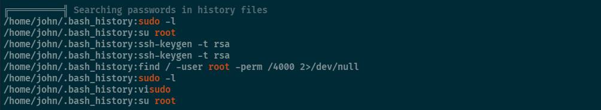

I ran `linpeas.sh` to see if I can find something to `escalate my privileges`




```bash
john@bruteit:~$ cat user.txt
THM{a_password_is_not_a_barrier}
```

It appears that john has permission to run `/bin/cat` with `sudo permissions`. This will allow me to read files that John doesn't have read permissions.

```bash
john@bruteit:~$ sudo -l
Matching Defaults entries for john on bruteit:
    env_reset, mail_badpass, secure_path=/usr/local/sbin\:/usr/local/bin\:/usr/sbin\:/usr/bin\:/sbin\:/bin\:/snap/bin

User john may run the following commands on bruteit:
    (root) NOPASSWD: /bin/cat
john@bruteit:~$ 
```

